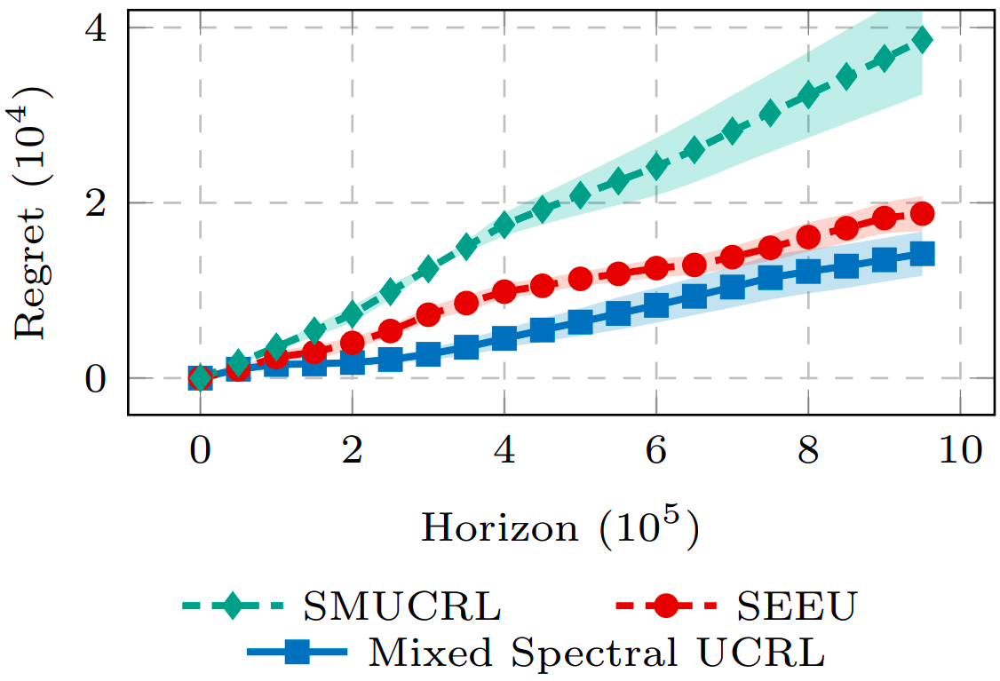

# Spectral Learning for Infinite-Horizon Average-Reward POMDPs

This repository contains the official implementation of the paper *Spectral Learning for Infinite-Horizon Average-Reward POMDPs* published at the 39th Conference on Neural Information Processing Systems (NeurIPS 2025). 

This work provides a new technique based on spectral decomposition strategies that helps combining samples coming from multiple adaptive policies to provably estimate the parameters of a POMDP model.  
We improve the sample-efficiency of state-of-the-art online learning algorithms for POMDPs by providing the **Mixed Spectral UCRL** algorithm which is the first algorithm to achieve $\widetilde{\mathcal{O}}(\sqrt{T})$ regret when compared against the best belief-based policy.

We provide below a **Table of Comparison**, in terms of both assumptions and results, of our work with respect to state-of-the-art approaches: the SM-UCRL algorithm [1] and the SEEU algorithm [2].

| **Table of Comparison**                                  | **SM-UCRL**         | **SEEU**                  | **Mixed Spectral UCRL**    |
|----------------------------------------------------------|---------------------|---------------------------|----------------------------|
| No Assumption on Minimum Entry for the Observation Model | ✅                   | ❌                         | ✅                          |
| No Assumption on Minimum Entry for the Transition Model  | ✅                   | ❌                         | ❌                          |
| No Assumption on Minimum Action Probability              | ❌                   | ✅                         | ✅                          |
| Works Under Memoryless Policies                          | ✅                   | ❌                         | ✅                          |
| Works Under Belief-based Policies                        | ❌                   | ❌                         | ✅                          |
| Sample Reuse with Different Policies                     | ❌                   | ❌                         | ✅                          |
| Compares Against the Strongest Oracle                    | ❌                   | ✅                         | ✅                          |
| Regret against the Strongest Oracle                      | $\mathcal{O}(T)$ | $\mathcal{O}(T^{2/3})$ | $\mathcal{O}(\sqrt{T})$ |


## Requirements

We recommend creating a virtual environment, activate it and install the required packages through:

```setup
pip install -r requirements.txt
```

## Project Structure
The main structure of the project is as follows:

```
├── environment
├── NeurIPS_experiments
├── plots
├── policies
├── simulations
    ├── estimation_error
    ├── regret
└── strategy
    ├── Mixed_Spectral_ucrl
    ├── Oracle
    ├── SEEU
    └── SMUCRL
└── run_estimation_error_experiments.py
└── run_regret_experiments.py
```
In particular:
- `environment` contains the implementations of the POMDP model class.
- `NeurIPS_experiments` contains the data saved from the runs of the experiments for both the estimation error and regret experiments.
- `plots` provides two different files that read the data saved in `NeurIPS_experiments` and allows visualizing the obtained results.
- `policies` contains the low-level implementation of the different policies used by the main algorithms, which are implemented in the `strategy` directory.
- `simulations` contains two different files with the main procedures followed to execute the estimation error and regret experiments.
- `strategy` contains the implementation of the *Mixed Spectral Estimation* algorithm and the algorithms used for the regret experiments: *Mixed Spectral UCRL*, *SM-UCRL* and *SEEU*.

Finally, `run_estimation_error_experiments.py` and `run_regret_experiments.py` are the two run files that allows setting the experiments hyperparameters and launch them.

## Results

Our *Mixed Spectral UCRL* improves over the competing baselines as shown below, where the experiments have been run on a POMDP instance having `S=3` states, `A=3` actions and `O=4` observations.




## References

[1] Azizzadenesheli, K., Lazaric, A., and Anandkumar, A. Reinforcement learning of pomdps using spectral methods.
In Annual Conference Computational Learning Theory, 2016.

[2] Xiong, Y., Chen, N., Gao, X., and Zhou, X. Sublinear regret for learning pomdps, 2022.

